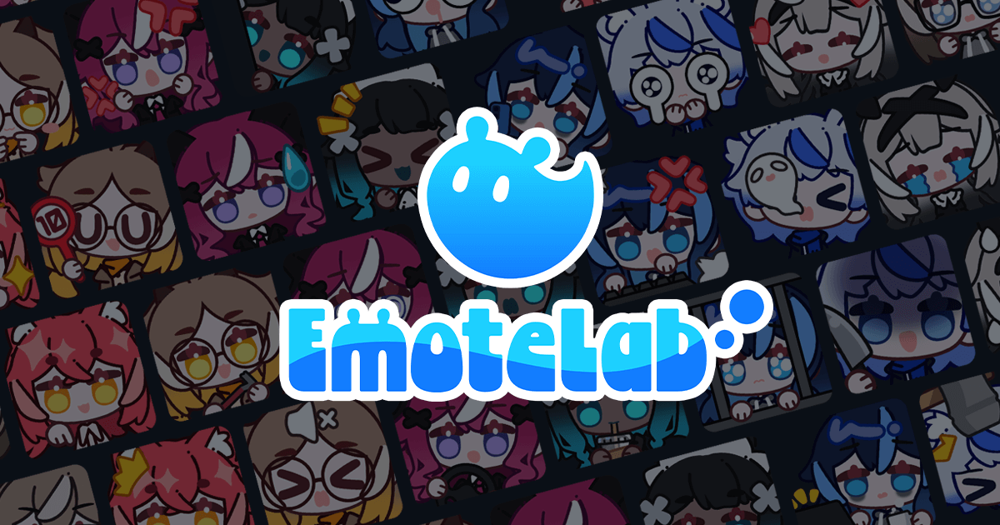

# 👋 Hi there, I'm 0x4682B4

## 💾 About Me
<table style="margin: 0;">
<tr>
<td width="65%" style="padding: 0; padding-right: 20px; vertical-align: top;">

- 💙 A regular human being who loves blue.

- 🌐 Language: CN | EN

- 📌 I'm currently working on **[EmoteLab](https://store.steampowered.com/app/4301100/)**.

- 🎨 I draw sometimes

- 🪚 I make Live2D and 3D models sometimes

- 💡 0x4682B4 is a color: ∎.
</td>
<td width="35%" align="center" style="padding: 0;">

</td>
</tr>
</table>

## 🎯 Current Focus

- 💤 Getting more sleep

- 🧋 Getting more milktea

- ✏️ Draw better

- ⚙️ Making better models

## 🧪 EmoteLab

---

**Thanks for visiting!** 💙

